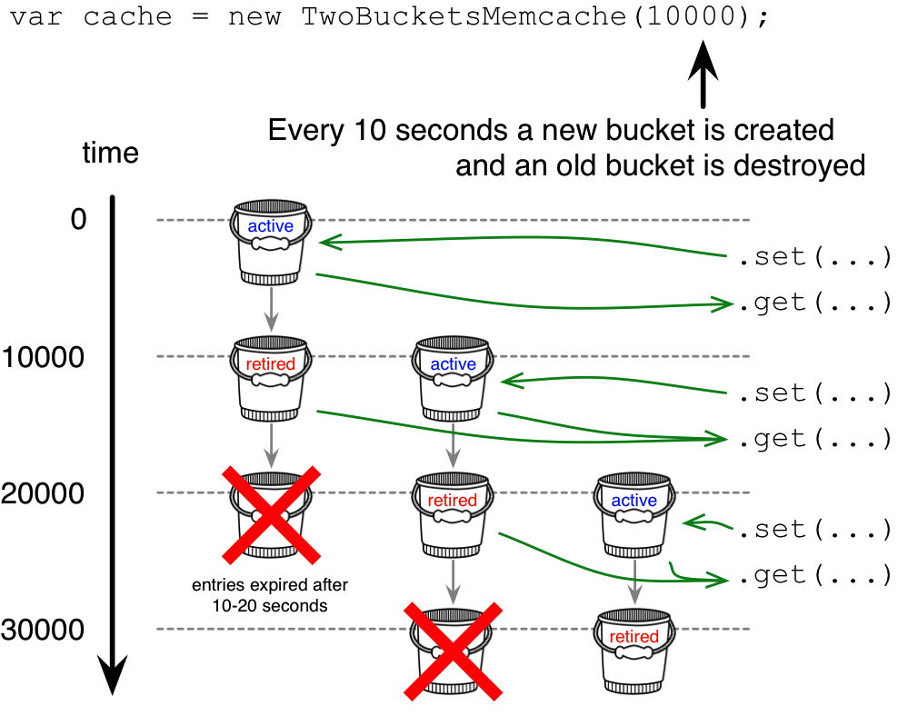

# Two Buckets Memcache

Memcache that trades a simplified expiry strategy for a super low resource consumption

[](https://travis-ci.org/analog-nico/two-buckets-memcache) [](https://coveralls.io/github/analog-nico/two-buckets-memcache?branch=master) [](https://david-dm.org/analog-nico/two-buckets-memcache)

## Installation

[](https://npmjs.org/package/two-buckets-memcache)

This is a module for node.js and is installed via npm:

``` bash
npm install two-buckets-memcache --save
```

## What is special about this memory cache?



The milliseconds you pass to the constructor define how soon the cache moves to a new bucket. The newest bucket is always the one in which new entries are stored. After the given milliseconds this bucket gets retired and is only used to get old cache entries. The second time the given milliseconds elapse, the retired bucket gets deleted and the old cache entries it contains expire with it. As a result a stored cache entry expires after 1x to 2x the given milliseconds, i.e. 10-20 seconds.

This design allows a super low resource consumption:

- Just a single timer is used, instead of one timer for each cache entry like many other memcaches do.
- The asymptotic runtime for `.has(...)`, `.get(...)`, `.set(...)`, and `.remove(...)` is still O(1) like you would expect.

## Usage

``` js
var TwoBucketsMemcache = require('two-buckets-memcache');

var cache = new TwoBucketsMemcache(10000); // Entries expire in 10-20 seconds.

cache.set('some key', { any: value });

cache.has('some key'); // -> true

cache.get('some key'); // -> { any: value }

cache.remove('some key');

cache.get('some key'); // -> throws an Error

cache.destroy(); // if cache is not needed anymore
```

## Contributing

To set up your development environment for two-buckets-memcache:

1. Clone this repo to your desktop,
2. in the shell `cd` to the main folder,
3. hit `npm install`,
4. hit `npm install gulp -g` if you haven't installed gulp globally yet, and
5. run `gulp dev`. (Or run `node ./node_modules/.bin/gulp dev` if you don't want to install gulp globally.)

`gulp dev` watches all source files and if you save some changes it will lint the code and execute all tests. The test coverage report can be viewed from `./coverage/lcov-report/index.html`.

If you want to debug a test you should use `gulp test-without-coverage` to run all tests without obscuring the code by the test coverage instrumentation.

## Change History

- v0.4.0 (2018-04-11)
    - Introduced `.has(key)` function
- v0.3.1 (2018-04-11)
    - Fix: Allow reserved object property names to be used as keys
- v0.3.0 (2016-04-03)
    - Optimized timer usage to use no timer when cache is empty
      *(Thanks to @blai for his tip in [issue #1](https://github.com/analog-nico/two-buckets-memcache/issues/1))*
    - Fix: `.set(...)` now throws an `Error` when called after `.destroy()`
    - Added error messages
    - Added node v5 to CI build
- v0.2.0 (2015-10-17)
    - Added `cache.remove(key)`
- v0.1.0 (2015-10-16)
    - Initial version

## License (ISC)

In case you never heard about the [ISC license](http://en.wikipedia.org/wiki/ISC_license) it is functionally equivalent to the MIT license.

See the [LICENSE file](LICENSE) for details.
